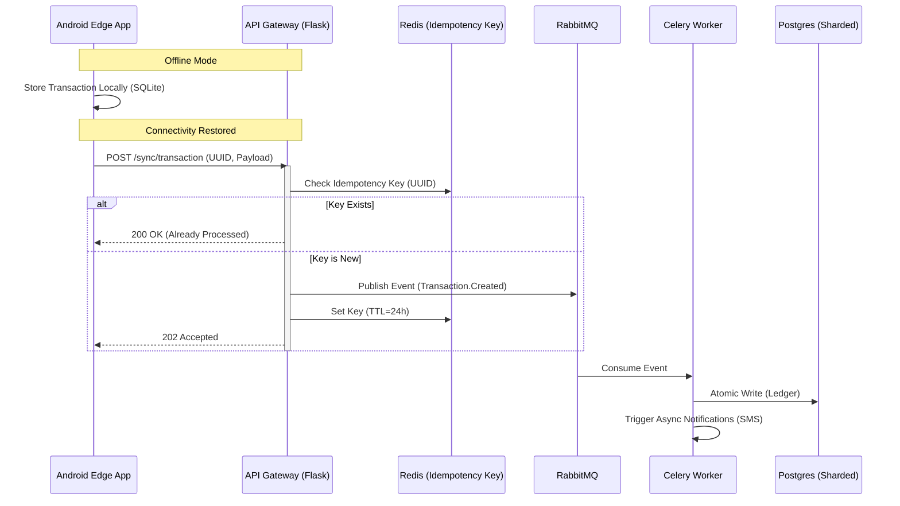
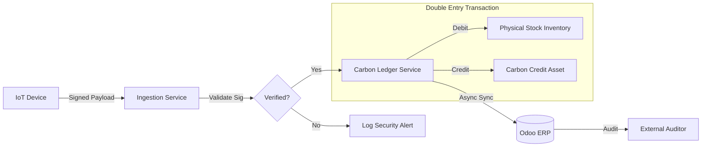

# Engineering Leadership & Architecture

**George Kagambi**, Senior Software Engineering Manager & Solution Architect \
<https://www.linkedin.com/in/georgekagambi> | <tiasho.kagambi@gmail.com>

## Executive Summary

I specialise in architecting resilient, offline-first distributed systems for emerging markets. My focus is on decoupling legacy monoliths into scalable microservices and aligning technical strategy with revenue goals. Below are select architectural case studies from my recent work.

   
## Case Study 1: Scaling IoT Payments in Low-Bandwidth Environments

**Role:** Lead Solution Architect & Senior Engineering Manager

### The Challenge
We needed to scale a fuel dispensing network from hundreds to thousands of IoT devices (ATMs). The existing monolithic backend was experiencing race conditions during high-traffic windows, and field devices suffered from intermittent connectivity, leading to lost transaction data.

### The Solution
I led the migration from a Monolith to an Event-Driven Microservices Architecture (Python/Flask on AWS).

* **Offline-First Sync Protocol:** Designed a custom sync protocol where the Android Edge Client (IoT device) acts as the "source of truth" for dispensing data. Transactions are cached locally (SQLite) and synced via an idempotent API once connectivity is restored.
* **Asynchronous Processing:** Decoupled the "User Request" from the "fulfillment logic" using RabbitMQ and Celery. This ensured that even if the Core Banking System was slow, the user experience at the ATM remained instant (~200ms response).
* **Database Sharding:** Migrated high-volume telemetry data to partitioned tables to maintain query performance as we hit millions of rows.

### The Impact
* Scaled to support 14 applications and 11 microservices.
* Achieved 99.9% uptime for field devices even during network fluctuating periods.
* Zero-downtime migration of live financial data.

   
## Case Study 2: Revenue Assurance & Carbon Credit Auditability

**Role:** Engineering Lead

### The Challenge
The business launched a Carbon Credit revenue stream requiring strict, auditable proof that specific fuel units were dispensed to specific users. The existing ERP (Odoo) lacked the granularity required for external carbon auditors.

### The Solution
I architected a "Shadow Ledger" system integrated with our core ERP.

* **Immutable Logs:** Built a write-only service that logged every fuel dispense event with cryptographic signatures from the IoT device.
* **ERP Integration:** Created a bi-directional sync between the custom IoT platform and Odoo. We used a "Double-Entry Inventory" model where carbon credits were treated as financial assets, ensuring the physical inventory matched the digital credit inventory exactly.
* **Fraud Detection:** Implemented heuristic algorithms to flag anomalous dispensing patterns (e.g., dispensing faster than physical flow rates allow) before the data hit the ledger.

### The Impact
* System passed rigorous external audits, unlocking a multimillion-dollar revenue stream.
* Reduced inventory variance between physical stock and digital records to <0.1%.

    
## Case Study 3: The "One Team" Distributed Engineering Culture

**Role:** Senior Engineering Manager

### The Challenge
A distributed team (Kenya & India) operating in silos. "Throwing code over the wall" led to a high defect rate and a slow cycle time.

### The Strategy
* **Cross-Functional Pods:** Restructured teams from "Frontend vs. Backend" into "Feature Pods" (e.g., Payments Pod, Supply Chain Pod) containing engineers from both geographies.
* **RFC (Request for Comments) Process:** Mandated that all architectural changes be written as design docs first. This leveled the playing field for remote engineers and created a paper trail for decisions.
* **Tech Debt Quota:** Enforced a "15% Rule"—every sprint must dedicate 15% of points to refactoring or test automation.

### The Impact
* 25% reduction in production bugs sprint-over-sprint.
* Deployed features 40% faster due to reduced back-and-forth between teams.
